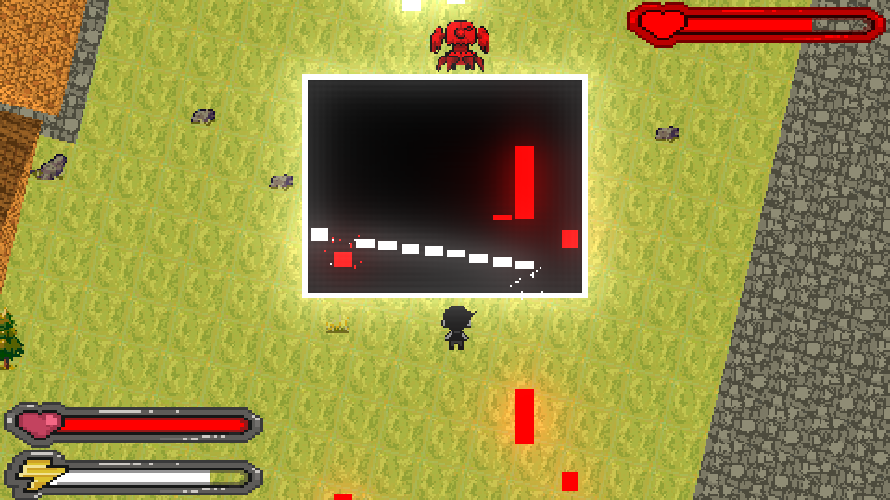
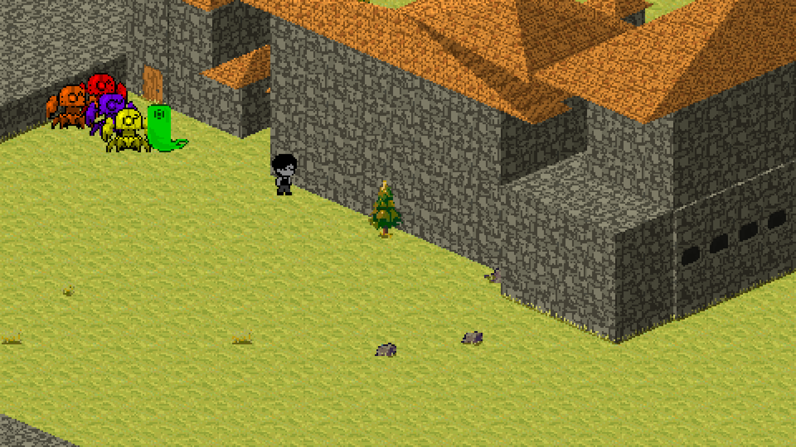
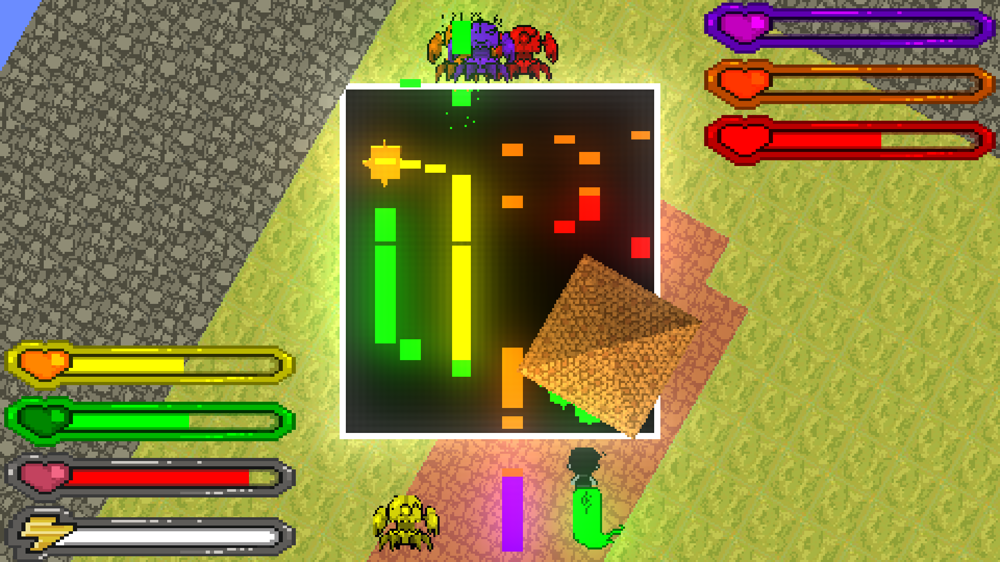

# Mellodica

Uma mistura de jogo de ritmo com Shoot'em Up.


[Vídeo de Gameplay](https://youtu.be/J3wr1rgTLiQ)

## Membros do grupo

- Giovanni Russo Paschoal (Full Stack, foco em engine/mecânicas/shaders)
- Luis Henrique Gomes Higino (Full Stack, foco em engine)
- Luisa Lopes Carvalhaes (Artes/Animações e outros assets)
- Luiza Sodre Salgado (Full Stack, foco em itens e puzzles)
- Raphael Aroldo Carreiro Mendes (Full Stack, foco em UI/HUDs)

Trilha sonora original composta por [jennix](https://www.reddit.com/user/abjagida_/). 

## Descrição

O objetivo principal é criar um ambiente em que seja possível traduzir melodias em padrões que precisam ser utilizados de forma estratégica em batalhas de tempo real e quebras-cabeça, além de contar uma pequena história sobre música.

As mecânicas básicas do jogo envolvem andar livremente por um nível e atirar notas musicais, de diferentes tonalidades e durações, em qualquer direção. As notas musicais causam dano ao atingir obstáculos e inimigos, mas ao colidirem com outras notas, interferem destrutivamente, anulando a nota de menor duração.


Ao se aproximar de um inimigo (ou grupo de inimigos), a orientação da câmera é fixada em sua direção, e uma batalha se inicia. Em uma batalha, é possível movimentar-se lateralmente, para desviar das notas lançadas pelos inimigos, para frente, para se aproximar deles, ou para trás, para se afastar ou fugir do conflito. Tanto o jogador quanto os inimigos podem tocar notas musicais para causar dano ao oponente. Caso a vida de um inimigo chegue a zero, ele é derrotado e o jogador ganha pontos de experiência, que são traduzidos para um aumento na vida e na energia máximas. Além disso, é possível defender as notas lançadas pelos inimigos, ao tocar o mesmo semitom pela mesma duração, anulando-a. 




**OBS**: A mecanica abaixo ainda nao foi implementada, no momento os inimigos sao automaticamente capturados quando derrotados.
Ao anular N notas seguidas de um inimigo (cujo N é específico para cada um) ele é “capturado” saindo da batalha e entrando no inventário do jogador. A batalha termina quando todos os inimigos tiverem sido eliminados ou capturados.




O objetivo do jogador é explorar o nível até encontrar a saída para o próximo, enfrentando batalhas e alguns quebra-cabeças no caminho.




## Instalação

Caso você esteja usando Linux, você pode simplesmente baixar a AppImage disponível [aqui](https://github.com/GiorussoP/Mellodica/releases/latest) e executá-la! Caso você nunca tenha usado um AppImage antes, [aqui segue um tutorial](https://docs.appimage.org/introduction/quickstart.html#how-to-run-an-appimage).

Caso contrário, você vai precisar compilar o código fonte do projeto. Para isso, primeiro clone o repositório ou baixe o zip do código fonte disponível [aqui](https://github.com/GiorussoP/Mellodica/releases/latest)

## Compilação

As instruções abaixo foram testadas no Linux e no MacOS. Compilar no Windows também deveria ser possível, mas não testamos. Para distribuições Linux diferentes de Ubuntu, basta adaptar a instalação das dependências, o que deveria ser tranquilo.

### Instalação das dependências

#### Ubuntu

Para compilar o jogo, primeiro instale as dependências:

``` shell
sudo apt update
sudo apt install -y \
    g++ cmake make \
    libsdl2-dev libsdl2-image-dev libsdl2-ttf-dev \
    libglew-dev libgl1-mesa-dev
```

Agora você vai instalar a biblioteca [fluidsynth](https://www.fluidsynth.org/). Você pode instalar ela com o apt caso esteja usando o Ubuntu LTS, caso contrário vai precisar instalar diretamente do código fonte. Isso pois precisamos de uma versão mais antiga da biblioteca para executar corretamente. Para garantir, compile e instale ela seguindo os comandos abaixo:

``` shell
curl -L -o fluidsynth.tar.gz \
    https://github.com/FluidSynth/fluidsynth/archive/refs/tags/v2.4.8.tar.gz
tar xf fluidsynth.tar.gz
cd fluidsynth-2.4.8
mkdir build && cd build
cmake .. -Denable-sdl2=1
make
sudo make install
```

#### MacOS

Caso você ainda não tenha o homebrew instalado, siga o tutorial [aqui](https://brew.sh/). Com o homebrew instalado, execute o comando abaixo para instalar as dependências:

``` shell
brew install \
    cmake glib jack sdl2 sdl2_image sdl2_ttf \
    glew libsndfile pkg-config gettext
```

Agora você vai instalar a biblioteca [fluidsynth](https://www.fluidsynth.org/). Primeiro, baixe o zip da versão 2.4.8 [aqui](https://github.com/FluidSynth/fluidsynth/releases/tag/v2.4.8). Após isso, extraia o zip e execute os seguintes comandos:

``` shell
curl -L -o fluidsynth.tar.gz \
    https://github.com/FluidSynth/fluidsynth/archive/refs/tags/v2.4.8.tar.gz
tar xf fluidsynth.tar.gz
cd fluidsynth-2.4.8
mkdir build && cd build
cmake .. \
    -Denable-sdl2=1 \
    -Denable-framework=0 \
    -Denable-floats=1 \
    -Denable-libsndfile=1 \
    -Denable-gentables=0 \
    -DCMAKE_INSTALL_PREFIX=/usr/local
make
sudo make install
sudo update_dyld_shared_cache
```

### Compilar o projeto

Agora, na raíz do projeto, rode os seguintes comandos

```shell
cmake -S . -B build -DCMAKE_BUILD_TYPE=Release
cmake --build build --config Release -j1
```

**Alerta**: O processo de compilação pode acabar consumindo MUITA memória do seu computador, se executado com várias threads. Para previnir isso, acima estamos executando o último comando passando uma quantidade de threads limitada a apenas 1 com `-j1`. Caso a compilação esteja muito lenta, você pode aumentar esse limite ou até mesmo deixar o Cmake decidir quantas threads utilizar com `-j`, mas note que isso pode acabar travando o seu computador e até mesmo crashar a compilação.

Com isso, o executável do jogo estará em `./build/mellodica`.

Para compilar a **versão de desenvolvimento**, troque o `CMAKE_BUILD_TYPE` para `Debug`.
