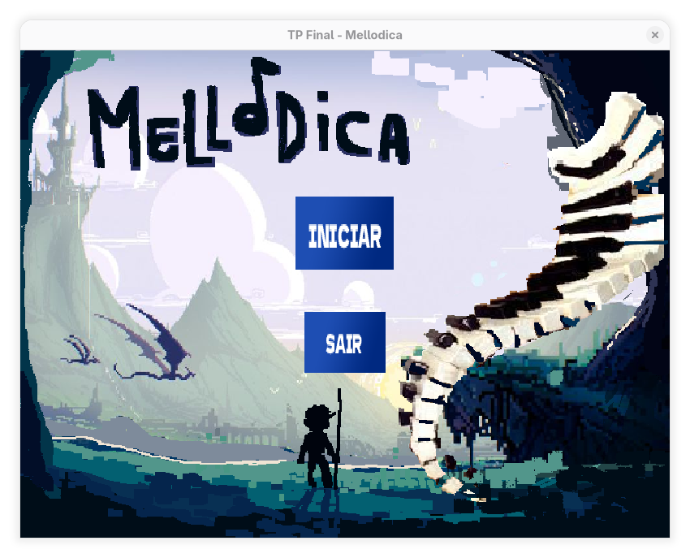
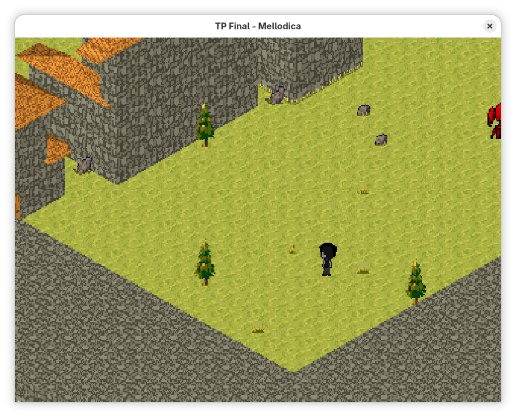
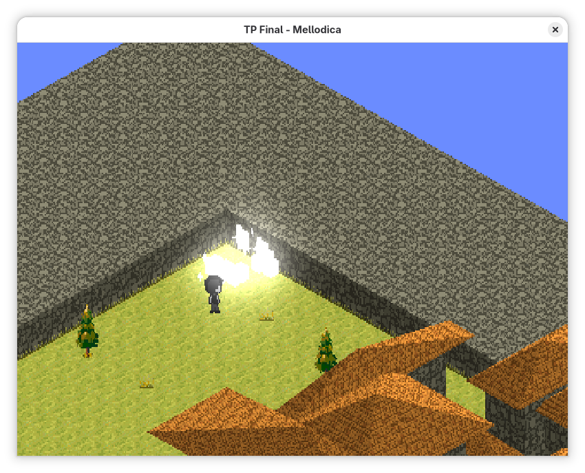
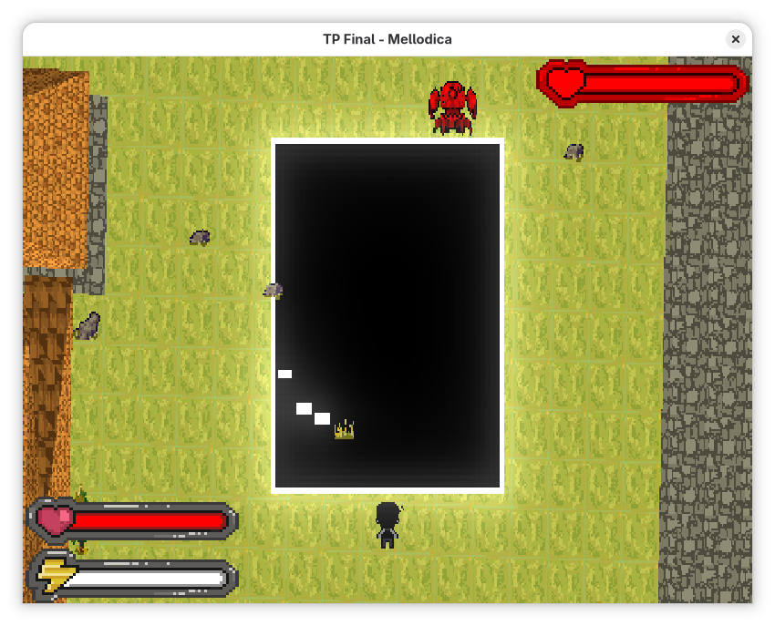
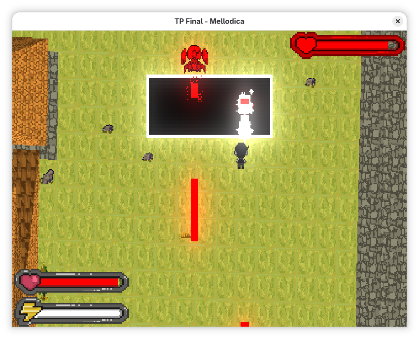
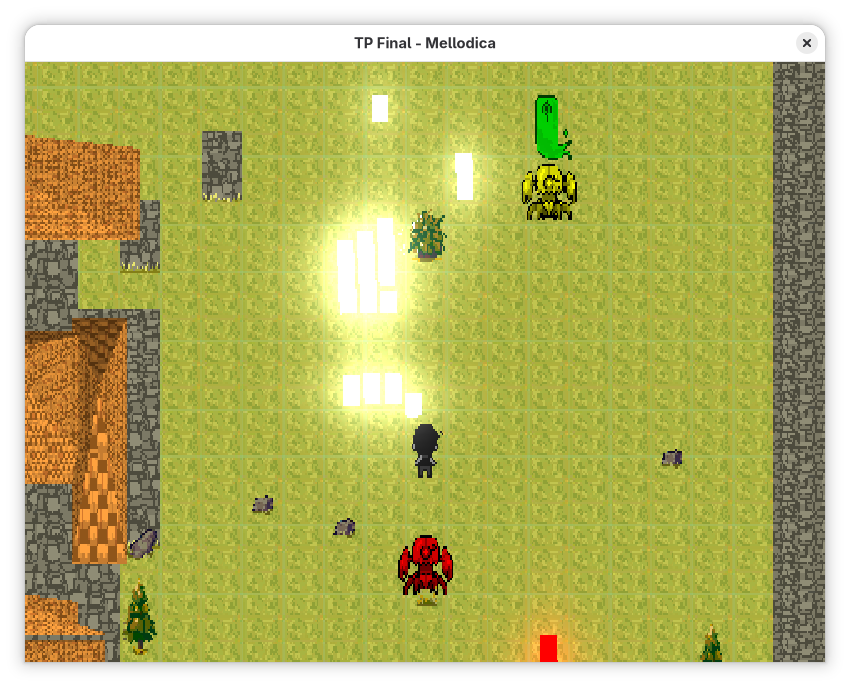
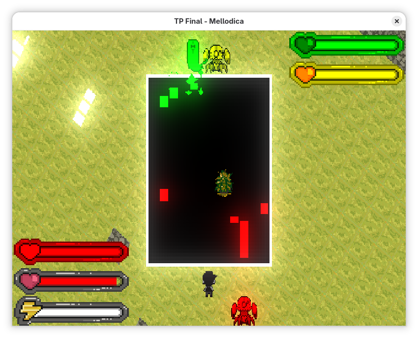

# Mellodica

Uma mistura de jogo de ritmo com Shoot'em Up.

## Membros do grupo

- Giovanni Russo Paschoa (Full Stack, foco em engine/mecânicas/shaders)
- Luis Henrique Gomes Higino (Full Stack, foco em engine)
- Luisa Lopes Carvalhaes (Artes/Animações e outros assets)
- Luiza Sodre Salgado (Full Stack, foco em itens e puzzles)
- Raphael Aroldo Carreiro Mendes (Full Stack, foco em UI/HUDs)

## Descrição

O objetivo principal é criar um ambiente em que seja possível traduzir melodias em padrões que precisam ser utilizados de forma estratégica em batalhas de tempo real e quebras-cabeça, além de contar uma pequena história sobre música.

As mecânicas básicas do jogo envolvem andar livremente por um nível e atirar notas musicais, de diferentes tonalidades e durações, em qualquer direção. As notas musicais causam dano ao atingir obstáculos e inimigos, mas ao colidirem com outras notas, interferem destrutivamente, anulando a nota de menor duração.

Ao se aproximar de um inimigo (ou grupo de inimigos), a orientação da câmera é fixada em sua direção, e uma batalha se inicia. Em uma batalha, é possível movimentar-se lateralmente, para desviar das notas lançadas pelos inimigos, para frente, para se aproximar deles, ou para trás, para se afastar ou fugir do conflito. Tanto o jogador quanto os inimigos podem tocar notas musicais para causar dano ao oponente. Caso a vida de um inimigo chegue a zero, ele é derrotado e o jogador ganha pontos de experiência, que são traduzidos para um aumento na vida e na energia máximas. Além disso, é possível defender as notas lançadas pelos inimigos, ao tocar o mesmo semitom pela mesma duração, anulando-a. 

**OBS**: A mecanica abaixo ainda nao foi implementada, no momento os inimigos sao automaticamente capturados quando derrotados.
Ao anular N notas seguidas de um inimigo (cujo N é específico para cada um) ele é “capturado” saindo da batalha e entrando no inventário do jogador. A batalha termina quando todos os inimigos tiverem sido eliminados ou capturados.

O objetivo do jogador é explorar o nível até encontrar a saída para o próximo, enfrentando batalhas e alguns quebra-cabeças no caminho.

## Controles

- A/D: mover câmera 
- Setas: mover personagem 
- ESPAÇO: solta nota
- 0-9,-+: solta nota específica 
- Esc: sai do jogo

## Funcionalidades a serem testadas

- Se movimentar pelo mapa
- Movimentar a camera
- Entrar e sair de batalhas
- Atirar notas musicais
- Desviar de ataques durante a batalha
- Ampliar e reduzir o campo de batalha com movimentação vertical
- Esconder atrás de objetos
